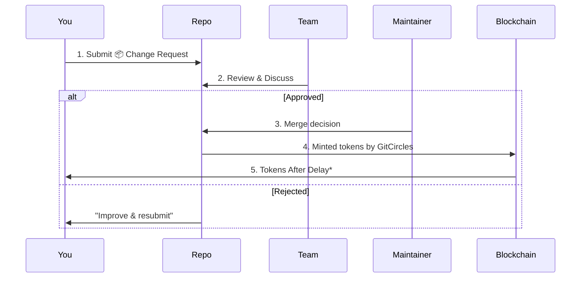
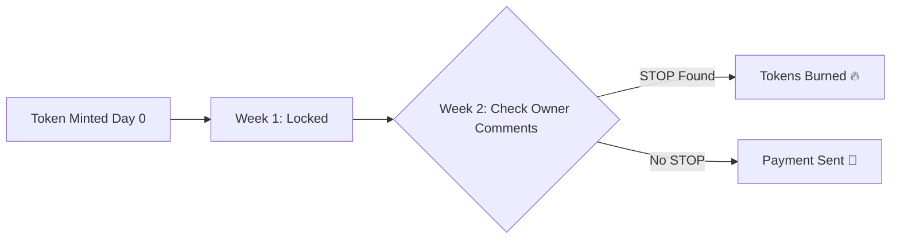

# GitCircles: Making Open Source Contributions Rewarding

## 📋 What is GitCircles?
GitCircles is an automated system that tracks contributions in Git-based projects and provides fair rewards to contributors. It turns code contributions into measurable value - **from commits to cryptocurrency**.

### 🌟 Why Does This Matter?
In open-source projects:
```diff
- Contributors often work without compensation
- Valuable work goes unrecognized
- Reward systems are manual and inconsistent
+ ✅ GitCircles solves these by automating fair rewards
```

### 📦 Change Request
It is a core concept. All platforms use different names for code contributions:
- GitHub: Pull Request (PR)
- GitLab: Merge Request (MR)
- Gitea: Pull Request (PR)
- Bitbucket: Pull Request (PR)

Instead of remembering multiple terms:
```
📦 Change Request = Any git-tracked proposal to improve the code with pinned discussion
```

## 🛠️ How It Works: The Big Picture
Imagine GitCircles as a bridge between your contributions and your cryptocurrency wallet:

```
     Work =========> Discussion =========> Rewards =========> DeFi
(Your PRs/MRs)   (+ Our Analysis)      (Your Tokens)    (Swap Tokens)
```

## 🔍 Breaking Down Contribution Types
Not all contributions are equal. GitCircles focuses on rewarding **merged changes**:

| Contribution Type | Rewarded? | Why? |
|-------------------|-----------|------|
| 🔄 Merged PR/MR   | ✅ Yes    | Directly adds new code |
| 🗣️ Discussions   | ❌ No     | Valuable but harder to measure |
| 🐛 Issue Reports | ❌ No     | Important but outside core functionality |
| 📄 Documentation | ✅ Maybe* | Depends on repository owner settings |

*Only when documentation is a part of the repository

## 📜 The Core Workflow: From Code to Coin
Here's the step-by-step journey of a contribution:



📝 Notes:
- *2-week holding period

## 💰 Setting Up Payment: Your Step-By-Step Guide
To receive rewards, you need to create a repository with a payment address:

1. **Create Your Payment Repo:**
   ```shell
   gh repo create gitcircles-profile --public
   ```

2. **Add Your [Ergo Wallet Address](https://docs.ergoplatform.com/dev/wallet/address/address_types/) to receive tokens:**
   ```shell
   cd gitcircles-profile
   echo "YOUR_P2PK_PUBLIC_KEY" > P2PK.pub
   git add P2PK.pub
   git commit -m "Add payment key"
   git push
   ```

   Example key: `9fRAWhdxEsTcdb8PhGNrZfwqa6...` (51 character hexadecimal)

   **Make sure you use `main` or `master` default branch name.**

4. **Keep It Updated:**
   GitCircles will **ALWAYS** use your most recent key - even if you change it while tokens are waiting!

## 📊 How Rewards Are Calculated
Rewards come from your **impactful code changes**:

```
Reward = Scope × Complexity Factor
```

Where:
- **Scope** = Lines changed × File importance
- **Complexity Factor** = Owner-defined weights (e.g., API code = 2x documentation)

### 📈 Example Scenario:
Emily submits a PR that:
- Modifies 50 lines of core API code (weight 1.5)
- Adds 20 lines of tests (weight 0.8)
- Changes 5 lines in docs (weight 0.2)

Her total tokens:
```
= (50 × 1.5) + (20 × 0.8) + (5 × 0.2)
= 75 + 16 + 1
= 92 tokens
```

## ⏳ The Safety Period: Why 2 Weeks?
Tokens aren't transferred immediately. Here's why:


**Owner Interventions:** Maintainers can cancel payouts with:
```markdown
<!-- STOP -->
Reason: This change breaks API compatibility which is not allowed by our code of conduct.
```

This creates a formal record of disputes.

## 🚧 Important Limitations & Challenges
While GitCircles automates rewards, there are some challenges:

| Challenge | Current State | Future Solution |
|-----------|---------------|----------------|
| ⚠️ Attribution | Hard with squashed commits | Improving SHA tracking |
| ⏱️ Metrics | Only code-based rewards | Adding issue/comment value |
| 🔐 Security | Key management risk | Signed commits + 2FA |
| 💰 Taxation | Not handled | Integrating compliance by demand |

## 🎯 Conclusion: Fairness Through Automation
GitCircles provides:
```diff
+ Automated tracking of valuable contributions
+ Transparent reward calculation
+ Secure payment processing
- No more unpaid work!
```
